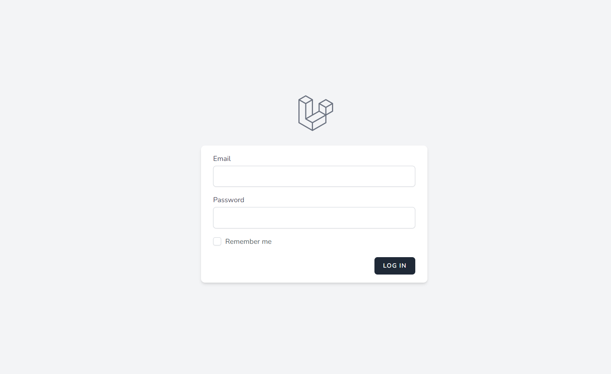
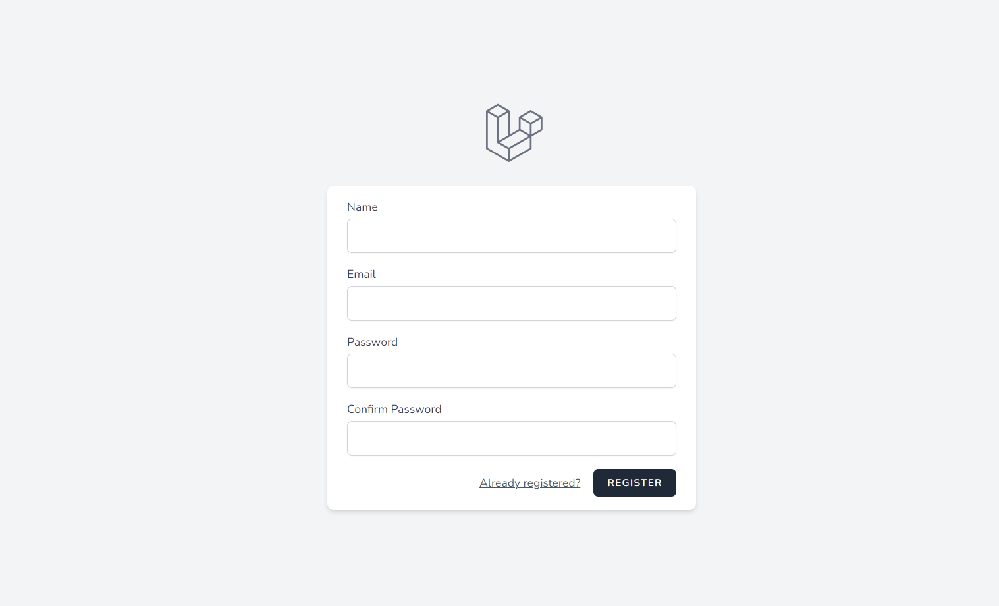
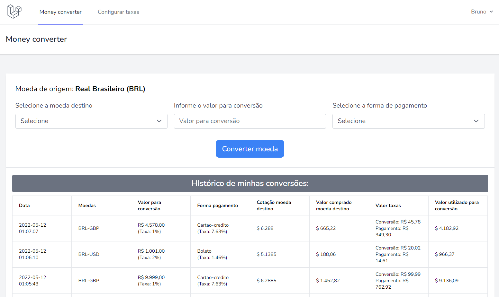
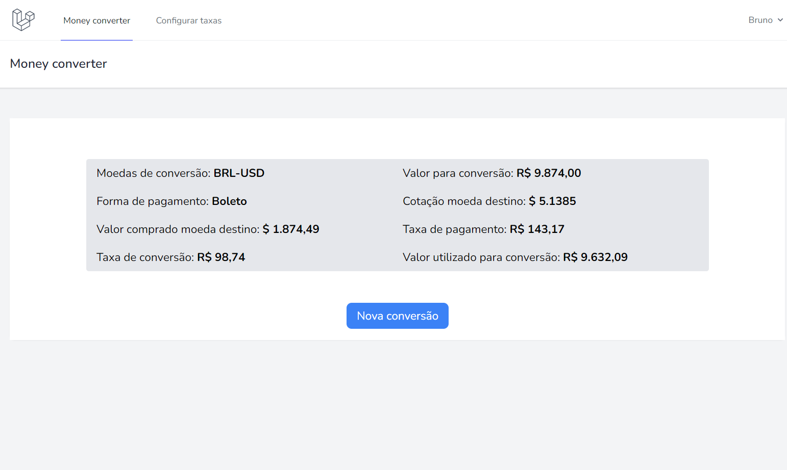
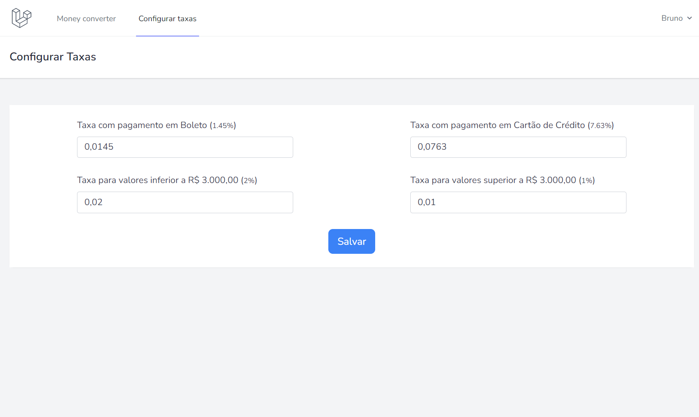
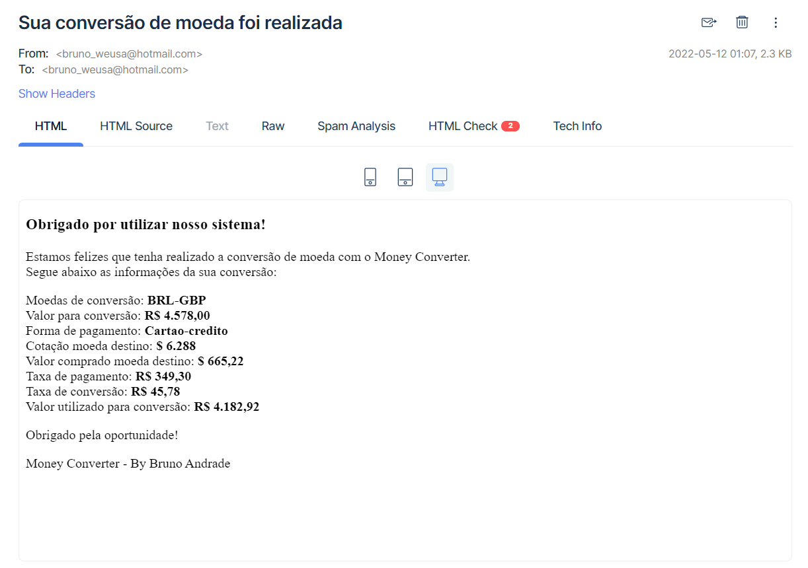

<p align="center"><a href="https://laravel.com" target="_blank"></a></p>


## Sobre o Money Converter

Money converter é um sistema de conversão da nossa moeda nacional para uma moeda estrangeira com a aplicação de algumas
taxas.

Para a cotação em tempo real das moedas estrangeiras disponíveis, foi utilizada uma API de moedas chamada AwesomeAPI.

### **As principais funcionalidades do sistema são as seguintes:**

- Para realizar uma conversão é necessário possuir cadastro e estar logado;
- O sistema disponibiliza 4 moedas estrangeiras: Dólar Americano (USD), Dólar Australiano (AUD), Euro (EUR) e Libra Esterlina (GBP);
- O usuário deve selecionar a moeda estrangeira, informar o valor e a forma de pagamento;
- O valor de compra em Real Brasileiro (BRL) deve ser entre R$ 1.000,00 e R$ 100.000,00;
- As taxas das formas de pagamento e de conversão podem ser customizadas no painel do sistema;
- O sistema registra o histórico de todas as conversões realizadas pelo usuário;
- A cada conversão realizada, o sistema envia um e-mail para o usuário cadastrado com os detalhes da transação.

### Tecnologias utilizadas:

- [PHP +7.4]
- [Framework Laravel 8.x](https://laravel.com/)
- [Laravel sail](https://laravel.com/docs/9.x/sail#installing-sail-into-existing-applications).
- [Laravel breeze](https://laravel.com/docs/9.x/starter-kits#laravel-breeze-installation).
- [Livewire](https://laravel-livewire.com/docs/2.x/quickstart#install-livewire).
- [Guzzle HTTP Client](https://laravel.com/docs/8.x/http-client#request-data).
- [Mailtrap](https://mailtrap.io/) - para simulação de envio de e-mail localmente
- [MySQL]

## Development setup

Basta clonar este repo e dar os comandos abaixo:

```sh
composer install
npm install
npm run dev
php artisan migrate
php artisan db:seed
```

```sh
Verificar as configurações no arquivo .env
```

### Prints do Sistema


<em>Tela de Login</em>

<hr>


<em>Tela de Cadastro</em>

<hr>


<em>Painel de conversão de moeda do usuário</em>

<hr>


<em>Detalhes de uma conversão de moeda</em>

<hr>


<em>Tela de configuração das Taxas de Pagamento e Conversão</em>

<hr>


<em>Caixa de e-mail (Mailtrap) com os detalhes da conversão de moeda do usuário</em>

<hr>

### Autor

- [Bruno Andrade](https://github.com/bnandrade)
- [Vídeo apresentação](https://www.loom.com/share/b1049c256e3b44ceaf8fbe3239fac8d6)

## License

The Laravel framework is open-sourced software licensed under the [MIT license](https://opensource.org/licenses/MIT).
